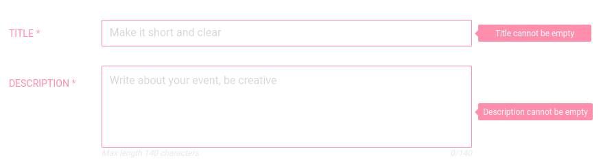

# Hotree
## About
Hotree is a simple social networking platform,
thanks to which a user can create a new event in an easy and pleasant way.
## Used Technologies</br>
Hotree form was written using JavaScript library React.  
Pure CSS was used to style components.  
To make class names and animation names scoped 
locally by default throughout the whole React application
[CSS Modules](https://github.com/css-modules/css-modules) 
was used.
## Installation and Usage
### Node modules
First step to make the application to work is to install node modules.  
In developer console install node modules by typing:  
#### npm users
```
npm install
``` 
#### yarn users
```
yarn
``` 
***Remember: the condition to install the required dependencies is to be in the same directory as package.json***
### Start using Hotree
**After going through all of the above steps** run application in a browser 
by typing below command in developer console
#### npm users
```
npm start
``` 
#### yarn users
```
yarn start
``` 
## Presentation of Hotree
### Event description
Event can be described by:
- creative name
- eye-catching description
- point-making choice of category
- free or paid
- coordinator in charge
- rewards points which users can collect for attendance
- starts date
### Validation and error handling presentation
Mandatory fields:


Proper email validation:

